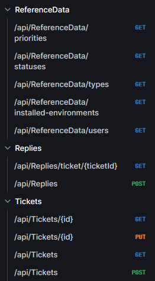

# Ticket Tracking System
## Project Overview

This Ticket Tracking System is a full-stack web application developed as a technical assessment. The implementation includes:
* **Backend**: .NET-based REST API utilizing clean architecture with four distinct layers
* **Frontend**: SPA application consuming the API endpoints built with React (Next.js)

## Backend
### Solution Structure

* **TicketTracking.Api**: API controllers, filters, handlers, and properties
* **TicketTracking.Core**: Core business logic, mapping configurations, services, and validators
* **TicketTracking.Domain**: Domain models (DTOs, entities), exceptions, interfaces, and pagination
* **TicketTracking.Infrastructure**: Data access implementation

### Notable Features

* **Clean Architecture:** Separation of concerns with distinct layers (API, Core, Domain, Infrastructure)
*** Global Exception Handling:** Centralized error handling using IExceptionHandler
* **Fluent Validation:** Request validation using FluentValidation
* **Object Mapping:** Efficient object mapping using Mapster
* **Repository Pattern:** Data access abstraction
* **API documentation:** API documentation generated from OpenAPI specification using Scalar

### API Endpoints

## Frontend
### Technology Stack

* React (Next.js)
* Automated API clients generation using `openapi-generator-cli`
* Material UI components

### Demo

<video width="640" height="360" controls>
  <source src="docs/demo.mp4" type="video/mp4">
  Your browser does not support the video tag.
</video>